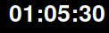
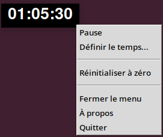

# Mini Tkinter Stopwatch ⏱️ 



🇫🇷 Voir la documentation en français plus bas

A minimalist, lightweight, and floating stopwatch utility written in Python. It was specifically designed for screen recording, video editing, and tutorial creation (particularly well-suited for Linux desktop environments).

## ✨ Features

* **Minimalist design:** No window borders or title bar (`overrideredirect`). A simple black background with white text for optimal visibility.
* **Always on top:** Stays above all your other windows to remain visible during your recordings.
* **Draggable on the fly:** Click and hold the left mouse button to drag it anywhere on your screen.
* **Context Menu (Right-click):**
  * **Close menu:** A pragmatic option to easily close the menu without focus issues on Linux.
  * **Pause / Resume:** Stops the timer (text turns gray to indicate pause) and resumes without losing track.
  * **Reset to zero:** Resets the timer to `00:00:00`.
  * **Set time...:** Forces the stopwatch to start from a specific time (`HH:MM:SS` format). Perfect if you cut a piece of video and want to resume the timer at the right moment!
  * **About / Quit:** Standard information and clean exit options.
* **Auto-centering:** Automatically appears at the center of your screen upon launch.

## 🚀 Installation & Usage

### Prerequisites
You only need Python 3 and its standard GUI library `tkinter` (usually pre-installed). 
If `tkinter` is missing on your Linux distribution (like Ubuntu or Linux Mint), 
you can easily install it using :
```bash
sudo apt install python3-tk
```
---
## 🇫🇷 Documentation en français

# Mini Chronomètre Tkinter ⏱️ 

Un petit utilitaire de chronomètre minimaliste, léger et flottant, écrit en Python. Il a été conçu spécialement pour la capture d'écran, le montage vidéo et la création de tutoriels (particulièrement adapté aux environnements Linux).

## ✨ Fonctionnalités

* **Design minimaliste :** Pas de bordure ni de barre de titre (`overrideredirect`). Un simple fond noir avec texte blanc pour une visibilité optimale.
* **Toujours au premier plan :** Reste par-dessus toutes vos autres fenêtres pour être toujours visible lors de vos enregistrements.
* **Déplaçable à la volée :** Clic gauche maintenu pour le glisser n'importe où sur l'écran.
* **Menu contextuel (Clic droit) :**
  * **Pause / Reprendre :** Arrête le temps (le texte devient gris pour indiquer la pause) et le relance sans perdre le fil.
  * **Réinitialiser à zéro :** Remet le compteur à `00:00:00`.
  * **Définir le temps :** Permet de forcer le chronomètre à démarrer depuis une heure précise (format `HH:MM:SS`). Idéal si vous avez coupé un bout de vidéo et souhaitez reprendre le compteur au bon moment !
  * **Quitter :** Ferme l'application proprement.
* **Centrage automatique :** Apparaît automatiquement au centre de l'écran lors du lancement.

## 🚀 Installation & Utilisation

### Prérequis
Vous avez uniquement besoin de Python 3 et de sa bibliothèque standard `tkinter` (généralement préinstallée). Si `tkinter` est manquant sur votre distribution Linux (comme Ubuntu ou Linux Mint), vous pouvez l'installer avec :
```bash
sudo apt install python3-tk
```
